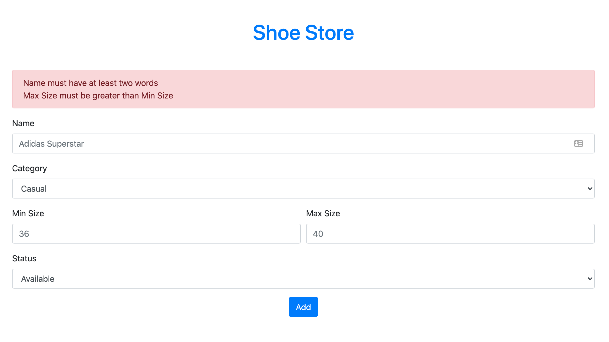

# Shoe Store

_⏰_ Time Estimation 180 minutes 


### Livecode 2 Phase 1

Sebuah toko sepatu meminta bantuan kamu untuk membuat aplikasi yang melakukan listing terhadap sepatu-sepatu yang mereka jual. Toko ini menjual sepatu hanya ber tipe Casual, Sports, Formal, dan Boots.

## Release 0 (5 Points)
Buatlah **Schema Diagram Database ERD** dengan ketentuan seperti pada `Release 1`. Kumpulkan hasil screenshot ERD kedalam folder git solusi ini.
> 1 Category bisa mempunyai banyak Sepatu,  
> 1 Sepatu hanya mempunyai 1 Category

## Release 1 (9 Points)
Buatlah *DATABASE* dengan menggunakan PostgreSQL dengan nama `shoestore`.
> Nama database WAJIB **shoestore**


Buatlah file `setup.js` yang berfungsi untuk membuat table `Categories` dan `Shoes` yang memiliki kolom-kolom sebagai berikut:

`Categories`
| Field | Datatype | Modifiers   |
| ----- | -------- | ----------- |
| id    | SERIAL   | PRIMARY KEY |
| name  | VARCHAR  | NOT NULL    |


`Shoes`
| Field      | Datatype | Modifiers   |
| ---------- | -------- | ----------- |
| id         | SERIAL   | PRIMARY KEY |
| name       | VARCHAR  | NOT NULL    |
| categoryId | INTEGER  | FOREIGN KEY |
| minSize    | INTEGER  | NOT NULL    |
| maxSize    | INTEGER  | NOT NULL    |
| status     | VARCHAR  | NOT NULL    |

Jalankan file `setup.js` untuk membuat table `Categories` & `Shoes` di dalam database `shoestore`.

**NOTE**

`minSize` dan `maxSize` adalah kolom yang digunakan untuk menyimpan ukuran terkecil dan terbesar yang dimiliki dari sebuah sepatu.

## Release 2 (7 Points)
Buatlah file `seed.js` yang berfungsi untuk melakukan seeding data ke dalam table `Categories` dan `Shoes` berdasarkan data dari `categories.json` dan `shoes.json`.

Jalankan file `seed.js` untuk melakukan seeding ke table `Categories` dan `Shoes`.

## Release 3 (8 Points)

Buatlah routing dengan menggunakan `ExpressJS` agar dapat melakukan CRUD operations dengan detail sebagai berikut:

| Method | Route                         | Keterangan                                                                                              |
| ------ | ----------------------------- | ------------------------------------------------------------------------------------------------------- |
| GET    | /                             | Menampilkan semua sepatu yang ada dalam database                                                        |
| GET    | /shoes/add                    | Menampilkan halaman form untuk menambahkan data sepatu                                                  |
| POST   | /shoes/add                    | Menerima data yang dikirim dari halaman `/shoes/add` untuk melakukan _insertion_ ke dalam table `Shoes` |
| GET    | /shoes/status/:id/available   | Melakukan _update_ data status sepatu berdasarkan `id` yang dikirim menjadi `Available`                 |
| GET    | /shoes/status/:id/discontinue | Melakukan _update_ data status sepatu berdasarkan `id` yang dikirim menjadi `Discontinued`              |
| GET    | /shoes/delete/:id             | Melakukan _delete_ data sepatu berdasarkan `id` yang dikirimkan                                         |

## Release 4 (49 Points)
### Halaman Home atau Route `/`
Implementasikan routing `/` dengan membuat halaman `Home` dimana halaman ini menampilkan semua sepatu yang ada pada database dalam bentuk list yang terdiri dari kolom id, name, category, size, status, dan action.

Pada kolom action terdapat 2 link yaitu `status` dan `delete` dengan ketentuan :
 - Button update status akan yang tampil adalah berdasarkan kondisi, jika data sepatu sekrang status nya `Available` maka button action akan mengarah ke link `/shoes/status/:id/discontinue` dan jika status sepatu `Discontinued` maka button action akan mengarah ke link `/shoes/status/:id/available`.
 - Button delete akan mengarah  `/shoes/delete/:id`

Data `minSize` dan `maxSize` ditampilkan dalam 1 table column Size dengan format `<minSize> - <maxSize>` seperti pada screenshot contoh berikut:


### Halaman Add Shoe atau Route `/shoes/add`
Halaman add akan menampilkan form untuk memasukkan data sepatu yang akan disimpan ke dalam database.

Untuk bagian `Category` menggunakan select input yang didapat secara dinis dari database `Categories`.

Untuk bagian `status` menggunakan select input yang terdapat 2 pilihan:
  - Available
  - Discontinued

Apabila berhasil menambahkan sepatu maka halaman akan berpindah ke home atau `/`


## Release 5 (12 Points)
### Update Status Shoe 
Release ini melanjutkan dari action button status dari halaman home dimana memiliki ketentuan :
 - Apabila action button `Available` maka akan mengarah ke routing `/shoes/status/:id/available` dan mengupdate status sepatu menjadi `Available`
 - Apabila action button `Discontinued` maka akan mengarah ke routing `/shoes/status/:id/discontinue` dan mengupdate status sepatu menjadi `Discontinued`
 - Apabila berhasil maka akan redirect lagi ke halaman home `/` dengan data sepatu yang sudah update
 - Apabila error tampilkan pesan error yang sesuai dengan minimal menggunakan `res.send`

### Delete Shoe atau Route `/shoes/delete/:id`
Untuk mengimplementasikan routing ini, kamu tidak perlu membuat halaman baru, tapi cukup dengan menekan tombol delete yang akan mengarahkan routing ke `/shoes/delete/:id` dimana proses delete akan dilakukan berdasarkan `id` yang dikirimkan. 

Apabila berhasil menghapus sepatu maka halaman akan berpindah ke home atau `/`

## Release 6 (10 Points)
Buatlah validasi pada **server** untuk fitur **Add** dan **Delete**

```txt
NOTE
Untuk pesan error bisa ditampilkan dengan menggunakan `res.send`. 
Pesan error bebas selama yang ditampilkan jelas dan sesuai dengan error yang terjadi.
```

### Add :
- `name`  minimal 2 kata
- `minSize` dan `maxSize` hanya boleh `angka`
- `maxSize` harus lebih besar dari `minSize`

Jika kondisi diatas tidak terpenuhi maka data tidak akan bertambah/berubah dan tampilkan pesan error.



### Delete:
- Hanya sepatu dengan `status` **Discontinued** yang dapat dihapus


